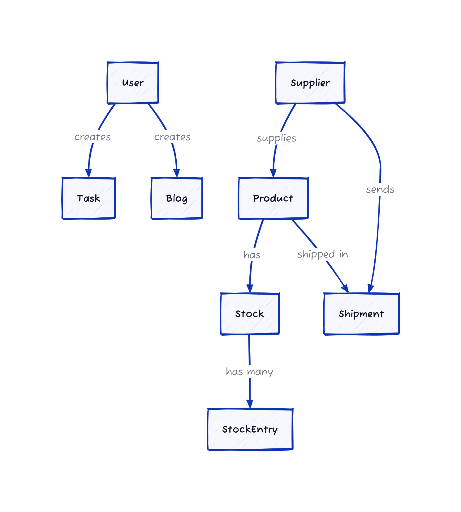

# 💼 Grocery Management System (Backend)

This is a backend system for a Grocery Store Manager to manage stock, tasks, and dashboards.

---

## 🚀 Tech Stack

- **Node.js** + **Express.js**
- **TypeScript**
- **Prisma ORM** + **PostgreSQL**
- **JWT Authentication**
- **Supertest + Jest** for testing

---

### 📊 Grocery Management Schema



## 🧑 User
- id: `String @id @default(uuid())`
- username: `String @unique`
- password: `String`
- firstName: `String`
- lastName: `String`
- email: `String`
- phone: `String`

## 📦 Product
- id: `String @id @default(uuid())`
- name: `String`
- type: `String` (e.g., Dairy, Grain)
- supplierId: `String`
- supplier: `Supplier @relation(fields: [supplierId], references: [id])`

## 🚚 Supplier
- id: `String @id @default(uuid())`
- name: `String`
- email: `String`
- phone: `String`

## 📊 Stock
- id: `String @id @default(uuid())`
- productId: `String @unique`
- product: `Product @relation(fields: [productId], references: [id])`
- totalQty: `Int @default(0)`

## 📝 StockEntry
- id: `String @id @default(uuid())`
- stockId: `String`
- stock: `Stock @relation(fields: [stockId], references: [id])`
- quantity: `Int`
- price: `Float`
- sellingPrice: `Float`
- cashier: `String`
- status: `String` (Available, Low, OutOfStock)
- dateAdded: `DateTime`

## ✅ Task
- id: `String @id @default(uuid())`
- taskType: `String` (Order-Related, Stock-Related)
- assignee: `String`
- priorityLevel: `String` (Low, Medium, High, Critical)
- description: `String`
- dueDate: `DateTime`
- location: `String`

## 📦 Shipment
- id: `String @id @default(uuid())`
- productId: `String`
- product: `Product @relation(fields: [productId], references: [id])`
- supplierId: `String`
- supplier: `Supplier @relation(fields: [supplierId], references: [id])`
- quantity: `Int`
- price: `Float`
- deliveryDate: `DateTime`
- shipperName: `String`
- shipmentDestination: `String`
- shipmentStatus: `String`
- lat: `Float`
- long: `Float`

## 📰 Blog
- id: `String @id @default(uuid())`
- title: `String`
- description: `String`
- image: `String`
- createdBy: `String`
- createdDate: `DateTime`
- year: `Int`


---

## ✅ Features

### Authentication
- `POST /api/auth/signup`
- `POST /api/auth/signin`
- `GET /api/user/profile`
- `POST /api/auth/signout`

### Dashboard
- `GET /api/dashboard/orders`
- `GET /api/dashboard/shipment`
- `GET /api/dashboard/blogs`

### Inventory
- `POST /api/inventory`
- `GET /api/stockDetails`
- `GET /api/inventory/summary`
- `GET /api/inventory/orders`
- `GET /api/inventory/newStock`

### Tasks
- `POST /api/tasks`

### Blogs
- `GET /api/blogs/all`
- `GET /api/blog/:id`

### Shipments (view-only)
- `GET /api/shipmentDetails`

---

## 🛠 Setup

1. Clone the repo:
   ```bash
   git clone <repo-url>
   cd grocery-backend
   ```

2. Install dependencies:
   ```bash
   npm install
   ```

3. Configure `.env` file:
   ```env
   DATABASE_URL=postgresql://<user>:<password>@localhost:5432/grocery
   JWT_SECRET=your_jwt_secret
   ```

4. Run migrations:
   ```bash
   npx prisma migrate dev --name init
   ```

5. Seed the DB:
   ```bash
   npx prisma db seed
   ```

6. Start the server:
   ```bash
   npm run dev
   ```

---

## 🥪 Run Tests

```bash
npm test
```

---

## 📦 Sample Credentials

```json
{
  "username": "manager1",
  "password": "password123"
}
```

---

## ✅ Notes

- Sample shipment/order data is hardcoded in `prisma/seed.ts`
- The backend is focused only on **manager responsibilities**
- Task creation triggers inventory workflows


---

